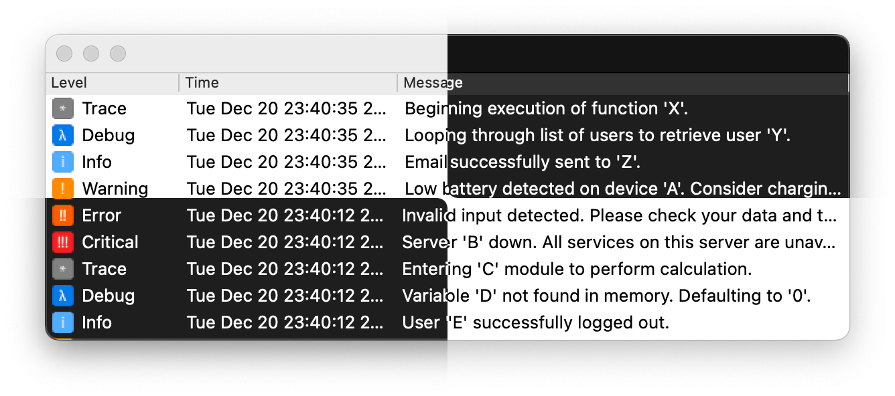

# QSpdLog



This repository contains the source code of a library, which provides a Qt widget for displaying log messages coming from the [spdlog](https://github.com/gabime/spdlog) library.

## Features

* Display log messages in a tree view
* Display an icon for each log level
* Separate message structure from message content
* Search in messages
  * via regular expressions
  * use match case option
* Auto scrolling feature with various options
  * disabled
  * scroll to the bottom when a new message is added
  * scroll to the bottom when a new message is added unless the user scrolled up
* **many more to come**
* **[request or suggest new ones](https://github.com/arsdever/qspdlog/issues/new/choose)**

## Usage

In its initial implementation only CMake tool is considered. To use the library in your project, you have:

1. Add the library as a submodule (or any kind of folder in your machine)

   ```bash
   git submodule add https://github.com/arsdever/qspdlog.git
   ```

2. Add the library to your CMake project

   ```cmake
   add_subdirectory(qspdlog)
   ```

3. Add the library to your target

   ```cmake
   target_link_libraries(${PROJECT_NAME} qspdlog::lib)
   ```

4. Include the interface header into the source file where you want to instantiate the widget

   ```cpp
   #include <qspdlog/qspdlog.h>
   ```

5. Instantiate the widget, register loggers and show the widget

   ```cpp
   QSpdLogWidget* widget = new QSpdLogWidget();

   auto sink = widget->sink();
   // register the sink to whatever logger you want

   widget->show();
   ```

A complete example can be found in the [sample](sample) folder.

> Note: In the sample it's considered that you already added the library as a submodule.

## License

This project is licensed under the MIT License - see the [LICENSE](LICENSE) file for details.

## Acknowledgments

* [spdlog](https://github.com/gabime/spdlog) for the logging library
* [Qt](https://www.qt.io/) for the GUI framework

## Projects using QSpdLog

* [gamify](https://github.com/arsdever/gamify)
